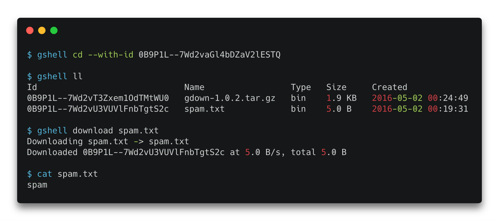

<h1 align="center">
  gshell = Google Drive + Shell
</h1>

<h4 align="center">
  Navigate in Google Drive as you do on shell.
</h4>

<div align="center">
  <a href="https://pypi.python.org/pypi/gshell"></a>
  <a href="https://pypi.org/project/gshell"></a>
  <a href="https://github.com/wkentaro/gshell/actions"></a>
</div>

<div align="center">
  
</div>


## Installation

```bash
pip install gshell

gshell init  # login to your google account
```


## Usage

```bash
$ gshell info --with-id 0B9P1L--7Wd2vaGl4bDZaV2lESTQ
Id: 0B9P1L--7Wd2vaGl4bDZaV2lESTQ
Name: 20160502_gdown
Path: 20160502_gdown
Mime: application/vnd.google-apps.folder
Created: 2016-05-02 00:17:25
Modified: 2017-12-23 01:56:42
Shared: True
ViewUrl: https://drive.google.com/open?id=0B9P1L--7Wd2vaGl4bDZaV2lESTQ

$ gshell cd --with-id 0B9P1L--7Wd2vaGl4bDZaV2lESTQ

$ gshell pwd
20160502_gdown

$ gshell ll
Id                             Name                 Type   Size     Created
0B9P1L--7Wd2vT3Zxem1OdTMtWU0   gdown-1.0.2.tar.gz   bin    1.9 KB   2016-05-02 00:24:49
0B9P1L--7Wd2vU3VUVlFnbTgtS2c   spam.txt             bin    5.0 B    2016-05-02 00:19:31

$ gshell download spam.txt
Downloading spam.txt -> spam.txt
Downloaded 0B9P1L--7Wd2vU3VUVlFnbTgtS2c at 5.0 B/s, total 5.0 B

$ cat spam.txt
spam
```


## Commands

```bash
Usage: gshell [OPTIONS] COMMAND [ARGS]...

Options:
  -V, --version  Show the version and exit.
  --help         Show this message and exit.

Commands:
  about     show account status
  cd        change directory
  download  download file
  info      show file information
  init      initialize gshell
  ll        list files in detail
  ls        list files
  mkdir     make directory
  open      open current site on browser
  pwd       print current working directory
  rm        remove file
  share     share file
  switch    switch user
  upload    upload file
```
